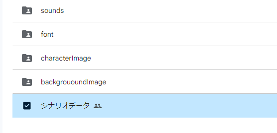
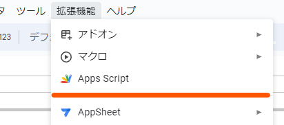
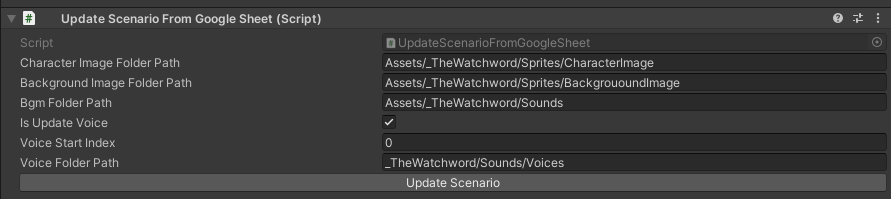

# Easy ADV

Unityで ADVを作成する際に Fungusを使ってより簡単に作成できるようにするためのライブラリです。

# 使い方

## シナリオ環境
1. [GoogleSheet](https://docs.google.com/spreadsheets/d/1k2AGDMgL6sLlIwmGZ5oQH2knIRoIAUhfyIYyVp93Nh0/edit?usp=share_link)をコピーする
2. 以下のように3つのフォルダを作成する
  - `sounds`
  - `characterImage`
  - `backgroundImage`



3. フォルダのIDを取得して、GoogleSheetのApps Scriptの`AutoUpdatePulldown.gs` の変数を作成したフォルダIDに変更する

```js
const characterImageFolder = "1JbdOEpA5ES2Rq9OqeNr2X98HyHu8ZTTg"
const backgroundImageFolder = "1TeW1IFjPKufBB9b-a9-BTDtJU9PSXIMe"
const soundFolder = "1pXyls5L5T_uWcw4lJyOtoCtXtm-8GynC"
```



4. Apps Scriptをデプロイして、ウェブアプリURLを取得する

## Unity環境
1. [EasyADV.unitypackage](https://github.com/MidraLab/easy-adv/releases)をダウンロードする
2. [Fungus.unitypackage](https://github.com/MidraLab/fungus/releases)をダウンロードする
3. Unityプロジェクトに1,2をimportする
4. 以下のフォルダに画像、音声を配置する
   - `Asset/EasyADV/CharacterImage`
   - `Asset/EasyADV/BackgroundImage`
   - `Asset/EasyADV/Sound`
5. シーン上の任意のオブジェクトに`UpdateScenarioFromGoogleSheet`をアタッチする。このときに4で作成したフォルダパスを設定する



6. `ScenarioSheetData.cs`の以下の変数を設定する

```cs
public static class ScenarioSheetData
{
  public const string SheetURL =
      "SheetURL";

  public const string MainSheet = "シート名";
}
```

7. Google Sheetにシナリオを記載後、`UpdateScenarioFromGoogleSheet`の`Update`ボタンを押す